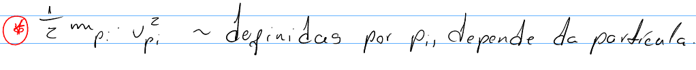
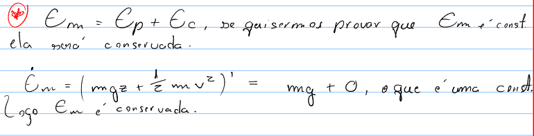
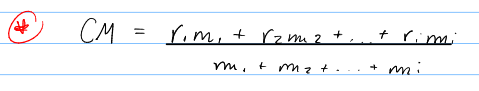
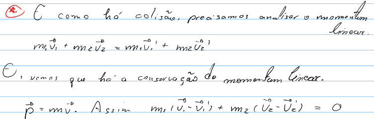
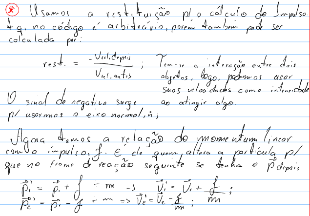
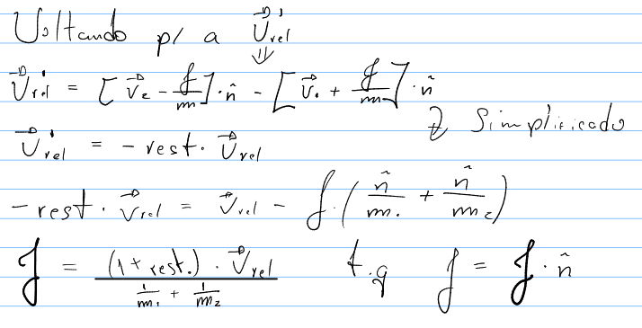

# 🎱 Simulação de Colisões com Partículas e Bola de Sinuca
## 📖 Introdução
Este projeto é uma simulação interativa que combina conceitos de física computacional com a programação de um pequeno jogo. Ele simula as colisões entre partículas (como bolas de sinuca), criando uma interface visual para demonstrar fenômenos físicos como conservação de momento e colisões elásticas.

### Objetivos
- Simular colisões entre partículas e objetos em um ambiente controlado.
- Demonstrar conceitos de física como conservação de energia e momentum.
- Criar uma interface visual interativa utilizando a biblioteca Pygame.
O projeto é inspirado no capítulo 2 do livro Computational Physics e em vídeos educativos como Building Collision Simulations do canal Reducible. A ideia surgiu do desejo de criar uma aplicação que una teoria física e programação em uma experiência prática.

### Como usar
Instalar as dependências necessárias:
```bash
pip install pygame
```
```bash
pip install numpy
```
Ou use o alternativo, se necessário:

```bash
sudo apt install python3-pygame
```

```bash
sudo apt install python3-numpy
```

### Simulação e Interação
A simulação é controlada por uma interface gráfica, onde o usuário pode ver e interagir com as partículas (bolas de sinuca). O comportamento das colisões, as energias cinéticas e potenciais, além do movimento das bolas, são visualizados em tempo real.

## 🛠 Desenvolvimento
### 📦 Estrutura do Projeto
O projeto está dividido em duas partes principais: o 2d-colision e o pool-game.py.
Falamos aqui somente do 2d-colision porque é o mais completo do projeto. Fica como observação o 2º projeto, pois ele é mais direto.

### Simulação de Física:

#### Partículas: Implementação de partículas com propriedades como posição, velocidade, massa e raio.
Gerenciamento de colisões: Utilização de vetores e leis de conservação para detectar e processar colisões.
Atualização do estado das partículas: Movimentação das partículas ao longo do tempo, com simulação de força gravitacional e colisões elásticas.
Interface de Sinuca:

#### Mesa de Sinuca: Representação gráfica de uma mesa de sinuca usando Pygame.
- Bolas de Sinuca: Criação de bolas (partículas) que se movem na mesa e colidem entre si.
- Gerenciamento de colisões com bolsões e bordas: Detecção de colisões das bolas com os limites da mesa e os bolsões.
#### Fluxo do Código
O código simula as partículas em um ambiente 2D (mesa de sinuca) onde as bolas colidem entre si e com as bordas. A física das colisões é baseada em conceitos reais de conservação de energia e momentum, com a interação visual sendo feita com Pygame.

#### Partículas são criadas com atributos como massa, posição, velocidade e raio.
- Colisões são detectadas e resolvidas usando a física de colisões elásticas (conservação de energia cinética e momentum).
- Movimento das partículas é calculado a cada quadro com a aplicação de aceleração devido à gravidade e interações de colisão.

```python
import pygame
import numpy as np
```

## 🔬 Fluxo do Código

O código simula partículas em um ambiente 2D, com física baseada em:

Cada partícula é representada por uma posição em 2D, onde:

- `pos[0]`: Coordenada \(x\).
- `pos[1]`: Coordenada \(y\).

A imagem abaixo ilustra três possíveis casos de detecção de colisão:


Agora trabalhamos com as energias, colocando brutalmente conceitos físicos aqui

### Energia Cinética
A energia cinética (𝐸𝑘) é a energia associada ao movimento de um objeto. Ela depende da massa (𝑚) do objeto e da sua velocidade (𝑣).



### Energia Potencial
A energia potencial (𝐸𝑝) é a energia armazenada devido à posição de um objeto em um campo de forças, como o campo gravitacional.


No código, a energia potencial varia de acordo com a altura da partícula em relação ao "chão" ou à borda inferior da mesa de sinuca. Quando a partícula está no chão (h=0), sua energia potencial é zero.

### Energia Mecânica



### Centro de Massa



### Exemplo de cálculo do centro de massa

```python
def calculate_center_of_mass(particles):
    total_mass = sum(p.mass for p in particles)
    if total_mass == 0:
        return np.array([0, 0])
    weighted_positions = sum(p.mass * p.pos for p in particles)
    return weighted_positions / total_mass
```

## 🎯 Conceitos Avançados

Agora precisamos lidar quando a colisão é feita. (No caso das paredes são apenas if's e else's), mas para lidar com a colisão entre dois corpos é necessário:

- ### Conservação do Momento Linear
Durante uma colisão:



- ### Coeficiente de Restituição
Define a elasticidade da colisão:

- 1: Colisão perfeitamente elástica.
- 0: Colisão perfeitamente inelástica.
- 0 < rest < 1: Colisão parcialmente elástica.




O impulso é a força média aplicada durante uma colisão:




## Referências

- **Livro**: *Computational Physics* (Capítulo 2)
- **Canal**: *Reducible* – [Building Collision Simulations](https://www.youtube.com/watch?v=eED4bSkYCB8&ab_channel=Reducible)
