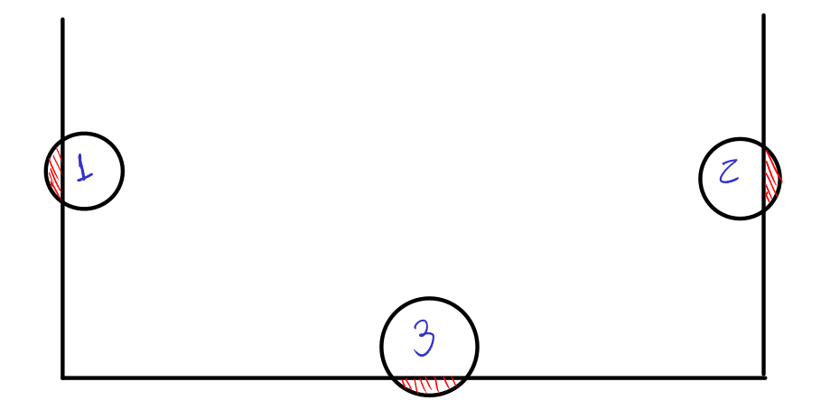

# 🎱 Simulação de Colisões com Partículas e Bola de Sinuca
## 📖 Introdução
Este projeto é uma simulação interativa que combina conceitos de física computacional com a programação de um pequeno jogo. Ele simula as colisões entre partículas (como bolas de sinuca), criando uma interface visual para demonstrar fenômenos físicos como conservação de momento e colisões elásticas.

### Objetivos
- Simular colisões entre partículas e objetos em um ambiente controlado.
- Demonstrar conceitos de física como conservação de energia e momentum.
- Criar uma interface visual interativa utilizando a biblioteca Pygame.
O projeto é inspirado no capítulo 2 do livro Computational Physics e em vídeos educativos como Building Collision Simulations do canal Reducible. A ideia surgiu do desejo de criar uma aplicação que una teoria física e programação em uma experiência prática.

### Como usar
Instalar as dependências necessárias:
```bash
pip install pygame
```
```bash
pip install numpy
```
Ou use o alternativo, se necessário:

```bash
sudo apt install python3-pygame
```

```bash
sudo apt install python3-numpy
```

### Simulação e Interação
A simulação é controlada por uma interface gráfica, onde o usuário pode ver e interagir com as partículas (bolas de sinuca). O comportamento das colisões, as energias cinéticas e potenciais, além do movimento das bolas, são visualizados em tempo real.

## 🛠 Desenvolvimento
### 📦 Estrutura do Projeto
O projeto está dividido em duas partes principais: o 2d-colision e o pool-game.py.
Falamos aqui somente do 2d-colision porque é o mais completo do projeto. Fica como observação o 2º projeto, pois ele é mais direto.

### Simulação de Física:

#### Partículas: Implementação de partículas com propriedades como posição, velocidade, massa e raio.
Gerenciamento de colisões: Utilização de vetores e leis de conservação para detectar e processar colisões.
Atualização do estado das partículas: Movimentação das partículas ao longo do tempo, com simulação de força gravitacional e colisões elásticas.
Interface de Sinuca:

#### Mesa de Sinuca: Representação gráfica de uma mesa de sinuca usando Pygame.
- Bolas de Sinuca: Criação de bolas (partículas) que se movem na mesa e colidem entre si.
- Gerenciamento de colisões com bolsões e bordas: Detecção de colisões das bolas com os limites da mesa e os bolsões.
#### Fluxo do Código
O código simula as partículas em um ambiente 2D (mesa de sinuca) onde as bolas colidem entre si e com as bordas. A física das colisões é baseada em conceitos reais de conservação de energia e momentum, com a interação visual sendo feita com Pygame.

#### Partículas são criadas com atributos como massa, posição, velocidade e raio.
- Colisões são detectadas e resolvidas usando a física de colisões elásticas (conservação de energia cinética e momentum).
- Movimento das partículas é calculado a cada quadro com a aplicação de aceleração devido à gravidade e interações de colisão.

```python
import pygame
import numpy as np
```

##### Parte principal do código que trata conceitos físicos

```python

    def kinetic_energy(self):
        # KE = 0.5 * m * v^2
        velocity_magnitude = np.linalg.norm(self.vel)
        return 0.5 * self.mass * velocity_magnitude**2

    def potential_energy(self, ground_level=0):
        # PE = m * g * h (h é a altura acima do chão)
        height = max(0, self.pos[1] - self.radius - ground_level)
        return self.mass * GRAVITY * height

    def mechanical_energy(self, ground_level=0):
        # ME = KE + PE
        return self.kinetic_energy() + self.potential_energy(ground_level)

```

#### Parte explicativa dos conceitos físicos:

##### A energia cinética é calculada sempre desta forma, pois independe do sistema, de suas forças aplicadas, se são conservativas, etc., isto porque é algo "pertencente" do objeto, depende de sua velocidade, $$\vec{v}$$, e de sua carga inercial, $$m$$

```markdown
    
A energia cinética de um corpo pode ser provada utilizando a relação entre força, deslocamento e trabalho.

Começamos com a definição de trabalho realizado por uma força:
\[
W = \int \vec{F} \cdot d\vec{s}
\]

Usando a segunda lei de Newton, temos que a força é dada por:
\[
\vec{F} = m \vec{a}
\]
onde \( m \) é a massa do corpo e \( \vec{a} \) é a aceleração.

Substituímos \( \vec{F} \) na equação do trabalho:
\[
W = \int m \vec{a} \cdot d\vec{s}
\]

Sabemos que \( \vec{a} = \frac{d\vec{v}}{dt} \), e podemos reescrever \( d\vec{s} \) em termos de \( \vec{v} \) e \( dt \):
\[
d\vec{s} = \vec{v} dt
\]

Substituindo na equação:
\[
W = \int m \frac{d\vec{v}}{dt} \cdot \vec{v} dt
\]

Cancelando \( dt \) e reescrevendo a equação:
\[
W = \int m \vec{v} \cdot d\vec{v}
\]

Expandindo o produto escalar \( \vec{v} \cdot d\vec{v} \), temos:
\[
W = m \int v \, dv
\]

Integrando:
\[
W = \frac{1}{2} m v^2 + C
\]

Assumindo \( C = 0 \) para o caso inicial, o trabalho realizado é igual à energia cinética:
\[
W = \frac{1}{2} m v^2
\]

Assim, mostramos que a energia cinética é dada por:
\[
E_k = \frac{1}{2} m v^2
\]
```
##### A energia potêncial depende da posição em relação à algo, geralmente ao "chão", aqui é do mesmo modo, com o limite "bottom", percebe-se que a energia potêncial do objeto partícula ao tocar no chão é 0. 

```markdown 
**Definição de Força Conservativa**  
A energia potencial em um campo de forças conservativas é definida como:
\[
E_p(r) = - \int \vec{F} \cdot d\vec{r},
\]
onde \(\vec{F}\) é a força que age no sistema e \(d\vec{r}\) é o deslocamento infinitesimal.

**Força Gravitacional**  
No caso da queda livre, a força que atua é o peso do corpo, dado por:
\[
\vec{F} = m\vec{g},
\]
onde \(m\) é a massa do corpo e \(\vec{g}\) é o vetor aceleração da gravidade.

**Escolha do Referencial**  
Escolhemos um referencial em que o deslocamento ocorre ao longo do eixo vertical (\(z\)), positivo para cima. Assim:
\[
d\vec{r} = dz \hat{k}.
\]
A força gravitacional aponta para baixo (\(-\hat{k}\)), e o produto escalar \(\vec{F} \cdot d\vec{r}\) é:
\[
\vec{F} \cdot d\vec{r} = -mg \, dz.
\]

**Cálculo da Energia Potencial**  
Substituímos a expressão da força no cálculo da energia potencial:
\[
E_p(z) = - \int \vec{F} \cdot d\vec{r} = - \int (-mg) \, dz.
\]

**Integração**  
A integral resulta em:
\[
E_p(z) = \int mg \, dz = mgz + C,
\]
onde \(C\) é a constante de integração.

**Definição do Referencial**  
Escolhemos o referencial em que a energia potencial é zero (\(E_p = 0\)) no nível \(z = 0\). Assim, \(C = 0\) e a energia potencial é:
\[
E_p(z) = mgz.
\]

**Substituição do Altura (\(h\))**  
Chamando a coordenada vertical \(z\) de altura \(h\), obtemos:
\[
E_p(h) = mgh.
\]

```


##### Agora a energia mecânica é a soma da energia potêncial e cinética, e dependendo do sistema, i.e, se for constituido apenas de forças conservativas, a $$E_m$$ será 0.

```markdown
$$E_m = E_p + E_c $$
```

```python
def calculate_center_of_mass(particles):
    total_mass = sum(p.mass for p in particles)
    if total_mass == 0:
        return np.array([0, 0])
    weighted_positions = sum(p.mass * p.pos for p in particles)
    return weighted_positions / total_mass
```

##### O conceito de centro de massa foi introduzido em Cálculo II, onde as principais variáveis são: ρ(x) com a somatória das massas, em que cada massa i é multiplicada por sua posição, sua largura na função, na posição i, sendo tudo isso dividido pela somatória total das massas. Só que aqui em física básica 1 a gente só faz uma média ponderada.

\[
x_{\text{cm}} = \frac{\sum_{i=1}^{n} m_i \cdot x_i}{\sum_{i=1}^{n} m_i}
\]


#### Conceitos básicos do código

Quando criamos um simulador de partículas, precisamos representar cada partícula e implementar métodos para calcular suas interações físicas. 

### Representação das Partículas e Sistema de Coordenadas

Cada partícula é representada por uma posição em 2D, onde:

- `pos[0]`: Coordenada \(x\).
- `pos[1]`: Coordenada \(y\).

A imagem abaixo ilustra três possíveis casos de detecção de colisão:



## Conceito Final

### Conservação do Momento Linear

A **conservação do momento linear** é um princípio implícito no código. Durante uma colisão, o momento total do sistema (soma do produto da massa pela velocidade de todas as partículas) permanece constante. No código, isso é implementado ajustando as velocidades das partículas proporcionalmente às suas massas, aplicando o impulso gerado pela colisão.

### Coeficiente de Restituição

O **coeficiente de restituição** (`restitution`) define a elasticidade da colisão, influenciando a fração da velocidade relativa mantida após a colisão:

- `restitution = 1`: Colisão perfeitamente elástica (sem perda de energia cinética).
- \(0 < \text{restitution} < 1\): Colisão parcialmente elástica (há dissipação de energia).
- `restitution = 0`: Colisão perfeitamente inelástica (as partículas "grudam").

No sistema, utilizamos `restitution = 0.9`, indicando uma colisão predominantemente elástica, mas com alguma dissipação de energia.

### Conceito de Impulso

O **impulso** é a grandeza física responsável por alterar o momento linear de um corpo durante uma colisão. Ele é definido como:

\[
\mathbf{J} = \Delta \mathbf{P}
\]

onde \(\Delta \mathbf{P}\) é a variação do momento linear. Em termos práticos, o impulso é o produto da força média aplicada a um corpo pelo intervalo de tempo durante o qual ela atua:

\[
\mathbf{J} = \mathbf{F} \cdot \Delta t
\]

No código, o impulso escalar é calculado como:

\[
J = \frac{-(1 + \text{restitution}) \cdot v_{\text{rel,along normal}}}{\frac{1}{m_1} + \frac{1}{m_2}}
\]

Onde:

- `restitution`: Coeficiente de restituição.
- \(v_{\text{rel,along normal}}\): Velocidade relativa das partículas ao longo do vetor normal de colisão.
- \(m_1\) e \(m_2\): Massas das partículas.

O vetor impulso é dado por:

\[
\mathbf{J} = J \cdot \mathbf{n}
\]

onde \(\mathbf{n}\) é o vetor normal à superfície de colisão.

O impulso é aplicado proporcionalmente às massas das partículas para ajustar suas velocidades, garantindo a conservação do momento linear e respeitando o coeficiente de restituição:

\[
\mathbf{v}_{1,\text{depois}} = \mathbf{v}_{1,\text{antes}} + \frac{\mathbf{J}}{m_1}
\]

\[
\mathbf{v}_{2,\text{depois}} = \mathbf{v}_{2,\text{antes}} - \frac{\mathbf{J}}{m_2}
\]

## Referências

- **Livro**: *Computational Physics* (Capítulo 2)
- **Canal**: *Reducible* – [Building Collision Simulations](https://www.youtube.com/watch?v=eED4bSkYCB8&ab_channel=Reducible)
- BERNARDES, Esmerindo. Materiais Didáticos: **Notas de Aula**. Disponível em: <edisciplinas.usp.br>. Acesso em: 6 dez. 2024.
